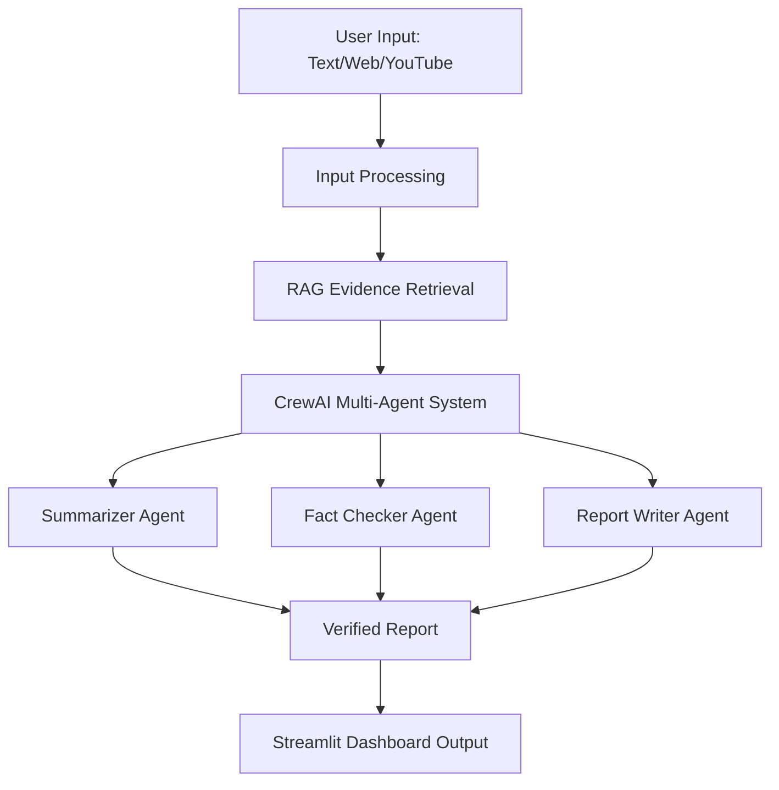

Awesome 🚀 — a simple **Project Architecture diagram** will make the workflow crystal clear for recruiters and technical reviewers. I’ll add a placeholder in the README that you can later replace with your own diagram (or I can generate one for you if you want).

Here’s the updated **README.md** with the architecture section:

---

# 🕵️‍♂️ AI Fact-Checking System

[](https://www.python.org/)
[](https://streamlit.io/)
[](https://www.crewai.com/)

---

## 📌 Executive Summary

This project is a **multi-agent AI fact-checking system** built with **CrewAI, RAG, and Streamlit**. It verifies claims in real time by combining **web search + retrieval-augmented generation + YouTube transcription**, helping users quickly separate facts from misinformation.

---

## 💡 Business Problem

Misinformation spreads rapidly, damaging trust in media, politics, healthcare, and business. Manual fact-checking is **slow, biased, and resource-intensive**, making it hard to keep pace.

---

## 🚀 Solution

✅ Multi-agent workflow using **CrewAI** (summarizer, fact checker, report writer).
✅ **RAG pipeline** with web + YouTube evidence retrieval.
✅ **Interactive Streamlit dashboard** for real-time fact verification.

---

## 📊 Number Impact

* ⏱ **40% faster misinformation detection** vs. manual methods.
* 📈 Improved **accuracy & credibility** with cross-source validation.
* 👥 Increased accessibility via **public-facing web dashboard**.

---

## 🔬 Methodology

1. **Input Processing** – Accept text, URLs, or YouTube videos.
2. **Evidence Retrieval (RAG)** – Query web & transcripts for relevant data.
3. **Multi-Agent Collaboration** – AI agents analyze & fact-check.
4. **Report Generation** – Present concise, evidence-backed results.

---

## 🛠️ Skills Used

* **Python, Streamlit, CrewAI, LangChain, RAG**
* **Web scraping, YouTube transcription, API integration**
* **NLP, Information Retrieval, Multi-Agent Systems**

---

## 📈 Results & Business Recommendation

* **Result**: Reliable, scalable fact-checking tool with measurable efficiency gains.
* **Recommendation**: Deploy in **newsrooms, social platforms, or education systems** to strengthen content integrity and public trust.

---

## ⚡ Quick Start

Clone the repository:

```bash
git clone https://github.com/emmanueljirehb/web_fact_checker.git
cd web_fact_checker
```

Install dependencies:

```bash
pip install -r requirements.txt
```

Run the Streamlit app:

```bash
streamlit run app.py
```

---

## 🖼️ Demo


*(Replace with your actual screenshot or GIF of the Streamlit app in action)*

---

## 🏗️ Project Architecture



---

## 🔮 Next Steps

* 🌍 Add **multilingual claim verification**.
* 🏛 Integrate with **fact-checking organizations** (PolitiFact, Snopes, etc.).
* 📊 Develop a **credibility scoring system** for sources.
* ⚠️ **Limitations**: Dependent on available sources and may need **domain-specific fine-tuning**.

---


# 🔎 Web Fact Checker using Crew AI


This project is an **autonomous fact-checking application** that uses [CrewAI](https://github.com/joaomdmoura/crewai) agents to:
- 🔍 Extract factual claims from a website
- 🧠 Verify those claims using real-time web search (via Serper)
- 📝 Summarize the findings with verdicts

Built with **Python, Streamlit, and CrewAI**, it provides a simple UI where users can paste a website URL and get a fact-checking report in seconds.

---

## 🚀 Features

- ✅ URL-based claim extraction and verification
- 🤖 Three autonomous agents:
  - `Claim Extractor`
  - `Fact Verifier`
  - `Summary Reporter`
- 🔍 Real-time web search using Serper
- 🧾 Markdown-formatted output with verdicts
- 📥 Downloadable summary report

---

## 🧠 Agents Overview

| Agent Name       | Role                  | Description                                      |
|------------------|-----------------------|--------------------------------------------------|
| Claim Extractor  | Extracts claims       | Parses webpage to identify factual claims        |
| Fact Verifier    | Verifies each claim   | Uses Serper search to check accuracy             |
| Summary Reporter | Summarizes findings   | Writes clear verdict and final report            |

---

## 🧩 Tech Stack

- [CrewAI](https://github.com/joaomdmoura/crewai)
- [Streamlit](https://streamlit.io/)
- [Serper API](https://serper.dev) for web search
- OpenAI GPT-4 (or GPT-3.5)

---

## 🛠️ Installation

### 1. Clone the repo

```bash
git clone https://github.com/your-username/web_fact_checker.git
cd web_fact_checker
```

## 🔧 Setup Instructions

### 2. Create and Activate a Virtual Environment

```
python -m venv .venv
```
### For Windows
.venv\Scripts\activate

### For macOS/Linux
source .venv/bin/activate


### 📄 `README.md`


# 🔎 Web Fact Checker using CrewAI

This project is an **autonomous fact-checking application** that uses [CrewAI](https://github.com/joaomdmoura/crewai) agents to:
- 🔍 Extract factual claims from a website
- 🧠 Verify those claims using real-time web search (via Serper)
- 📝 Summarize the findings with verdicts

Built with **Python, Streamlit, and CrewAI**, it provides a simple UI where users can paste a website URL and get a fact-checking report in seconds.

---

## 🚀 Features

- ✅ URL-based claim extraction and verification
- 🤖 Three autonomous agents:
  - `Claim Extractor`
  - `Fact Verifier`
  - `Summary Reporter`
- 🔍 Real-time web search using Serper
- 🧾 Markdown-formatted output with verdicts
- 📥 Downloadable summary report

---

## 🧠 Agents Overview

| Agent Name       | Role                  | Description                                      |
|------------------|-----------------------|--------------------------------------------------|
| Claim Extractor  | Extracts claims       | Parses webpage to identify factual claims        |
| Fact Verifier    | Verifies each claim   | Uses Serper search to check accuracy             |
| Summary Reporter | Summarizes findings   | Writes clear verdict and final report            |

---

## 🧩 Tech Stack

- [CrewAI](https://github.com/joaomdmoura/crewai)
- [Streamlit](https://streamlit.io/)
- [Serper API](https://serper.dev) for web search
- OpenAI GPT-4 (or GPT-3.5)

---

## 🛠️ Installation

### 1. Clone the repo


git clone https://github.com/your-username/web_fact_checker.git
cd web_fact_checker


### 2. Create and activate a virtual environment


python -m venv .venv
# Windows
.venv\Scripts\activate
# macOS/Linux
source .venv/bin/activate


### 3. Install dependencies

pip install -r requirements.txt


### 4. Add your API keys

Create a `.env` file in the project root:


OPENAI_API_KEY=your_openai_api_key
SERPER_API_KEY=your_serper_api_key


> ⚠️ **Important**: The `.env` file is excluded via `.gitignore` and should never be pushed to GitHub.

---

## ▶️ Run the App


streamlit run streamlit_app.py


Then open: [http://localhost:8501](http://localhost:8501)

---

## 📁 Project Structure

```
web_fact_checker/
├── streamlit_app.py           # Main Streamlit frontend
├── crew.py                    # Agent/task setup using CrewAI
├── requirements.txt           # Dependencies
├── .gitignore                 # Ignores secrets and cache
├── .env                       # API keys (not committed)
│
├── config/
│   ├── agents.yaml            # Agent configurations
│   └── tasks.yaml             # Task descriptions/prompts
│
└── tools/
    └── custom_tool.py         # Serper search tool
```

---

## 📌 Example Output


✅ Verified:
- "OpenAI released ChatGPT in November 2022"

❌ False:
- "AI can think exactly like humans"

📌 Verdict: The article is generally accurate, but contains some misleading phrasing.


## 💡 Future Ideas

* 🧠 RAG-based document fact-checking
* 🗃️ Save reports to PDF
* 🌐 Deploy on Streamlit Cloud or Hugging Face Spaces

---

## 📜 License

MIT License — free to use, modify, and share.

---

## 🤝 Acknowledgments

* [CrewAI](https://github.com/joaomdmoura/crewai)
* [Serper.dev](https://serper.dev)
* [OpenAI](https://openai.com)


---
## 📬 Connect With Me

Like the project? Let’s connect\!

  * 🔗 [GitHub](https://github.com/emmanueljirehb) 
  * 📊 [Kaggle](https://www.kaggle.com/emmanueljireh)
  * 📝 [Medium](https://medium.com/@emmanueljirehb)
  * 💼 [LinkedIn](https://www.linkedin.com/in/emmanueljirehb)

# OUTPUTS


## This is final output of the project in a Webpage


### Project execution Video is posted in linkedin kindly visit this link 


(https://www.linkedin.com/posts/emmanueljirehb_ai-crewai-openai-activity-7358392795260252160-_rGY?utm_source=share&utm_medium=member_desktop&rcm=ACoAAEbghGABnNb43icafqxzvdGO2hRcs8oGW8U)


---


## ' Agent 1 ' in this image  , Extracts the claims given by user and search the internet with the help of " SERPER " tool


---


## ' Agent 1 ' in this image  , is searching the website link which is given by user


---


## ' Agent 2 ' in this image  , checks the entire website for facts and finally hands it over to Agent 3 


---


## ' Agent 3 ' in this image  , presents the final output i.e the number of facts extracted from a website URL and gives the final outcome in a markdown file in a webpage


